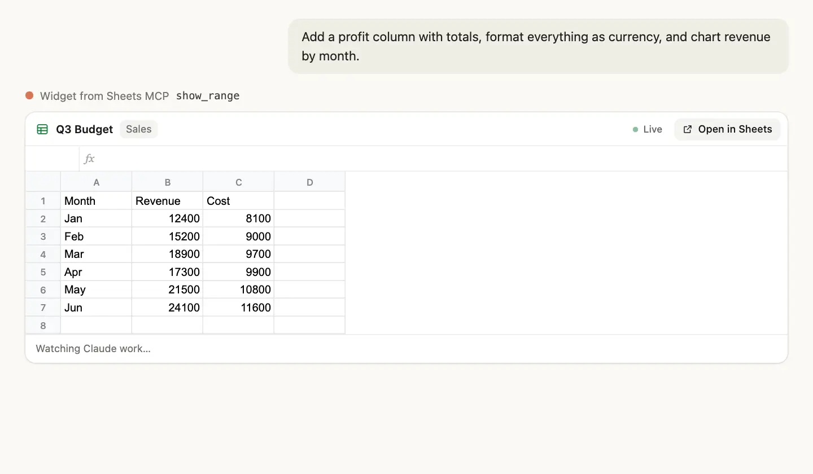

# Sheets MCP

The power tool for Google Sheets in Claude. A free, open-source MCP server that connects your spreadsheets to everything Claude Desktop and Claude Code can do: pull data from APIs and files into a sheet, build new sheets from your other sheets, keep them updated on a schedule, and work across several Google accounts. Formulas, formatting, charts and pivot tables included, with undo and formula-error checks on every write. It runs on your computer and talks to Google directly.

**[See all features and watch the demo at sheetsmcp.io →](https://sheetsmcp.io/?utm_source=github&utm_medium=readme&utm_campaign=top)**

[](https://sheetsmcp.io/?utm_source=github&utm_medium=readme&utm_campaign=hero-image)

Free and open source · Runs on your computer · Spreadsheet-only Google access · Claude Desktop and Claude Code

If Sheets MCP saves you time, a ⭐ on GitHub helps other people find it.

## Sheets MCP or Claude's built-in Google Sheets integration?

Claude now has its own [Google Sheets integration](https://claude.com/resources/articles/claude-now-works-in-google-docs-sheets-and-slides) on paid plans. Both let Claude edit your spreadsheets; they suit different jobs.

| | Sheets MCP | Claude's built-in integration |
|---|---|---|
| Best for | Work that reaches beyond one sheet: APIs, files, other sheets, schedules | Quick edits inside the sheet you have open |
| Price | Free, and works on the free Claude plan in Claude Desktop | Paid Claude plans |
| Where it works | Claude Desktop (Chat and Code tabs) and Claude Code | Claude chat, and a sidebar inside Google Sheets |
| Setup | One-click extension or one command. Google shows an "unverified app" screen at sign-in for now | Built in |
| Where your data goes | From your computer straight to Google, with access to spreadsheets only. No other servers | Through Anthropic's hosted connector |
| Code | Open source (MIT): read it, change it, run your own | Anthropic's product |
| Extras | Several Google accounts, undo, formula-error checks, live preview in the chat | Sidebar in Sheets, edit approvals, Python for data cleaning |

**In short:** on a paid plan and only want Claude to edit the sheet in front of you? The built-in integration is the simplest. Want Claude to pull your sheets together with everything else, for free? Use Sheets MCP. You can use both.

## Install

### Claude Desktop (easiest, no setup)

1. Install [Claude Desktop](https://claude.ai/download) and sign in.
2. Download **[sheets-mcp.mcpb](https://sheetsmcp.io/downloads/sheets-mcp.mcpb)**.
3. Double-click the file, then click **Install** in Claude Desktop.

New to Claude Desktop? Follow the [step-by-step setup guide](https://sheetsmcp.io/?utm_source=github&utm_medium=readme&utm_campaign=install#install).

The extension works in both the Chat and Code tabs. For long, multi-step jobs, the Code tab is the more dependable choice: it runs everything on your computer.

### Claude Code

Requires [Node.js](https://nodejs.org) 18 or newer. Run:

```bash
claude mcp add --scope user google-sheets -- npx -y @sheetsmcp/server
```

Then start a new Claude Code session.

## Sign in

The first time Claude uses Google Sheets, a Google sign-in page opens in your browser:

1. Choose your Google account.
2. Google shows **"Google hasn't verified this app"**. Click **Advanced**, then **Go to Sheets MCP**.
3. Click **Continue** to allow access to your spreadsheets.

To use more than one Google account, ask Claude to *"sign in to another Google account"*. When you paste a sheet link, Sheets MCP uses whichever of your accounts can open it.

To open the Google sign-in in a particular browser without changing your default, add `"browser": "Google Chrome"` (or another app name) to `~/.sheets-mcp/settings.json`.

If your company's Google Workspace blocks the sign-in, your Workspace admin can allow Sheets MCP under **Admin console → Security → API controls**.

## Try asking

In Claude Desktop, click **+** and choose **Get started with Google Sheets** for a quick tour. When more than one Google account is connected, Claude asks which account to use before creating a spreadsheet, or when a sheet can be opened by more than one of your accounts.

- "Summarize this sheet: <link>"
- "Add a Profit column that subtracts Cost from Revenue, and format it as currency"
- "Chart spending by month in this sheet: <link>"
- "Freeze the header row, bold it, and auto-fit the column widths"
- "Summarize revenue by region and product in a pivot table"
- "Change that chart to a line chart and move it next to the table"
- "Create a new spreadsheet called Trip Planner"
- "Open my budget sheet" (works for sheets you've used with Sheets MCP before)
- "Pull last week's Stripe payouts into the Cash tab" (Claude Code)
- "Combine the East and West sales sheets into a new Q3 summary with a chart"
- "Copy the Q4 forecast from my work account into the board sheet on my personal account"
- "Undo that"

[More example requests and everything Sheets MCP can do →](https://sheetsmcp.io/?utm_source=github&utm_medium=readme&utm_campaign=examples)

## Recently worked on

Sheets MCP keeps a list of the spreadsheets you've used with it, on your computer. In Claude Desktop, start talking about your sheets ("let's work on my budget") or ask "show my recent sheets", and a searchable list opens in the chat: pin the ones you use most, open them in Google Sheets, or tick several (even from different Google accounts) and send them to Claude with what you want done. In Claude Code, type `/mcp__google-sheets__recent_sheets` or ask "which sheets have I used?".

## Live preview

In Claude Desktop, Claude opens a live preview of your sheet in the chat while it works. You see each range it reads and each change it makes as it happens, charts included, and the preview folds away when Claude is done. **Open in Sheets** jumps to the same cells in Google Sheets.

After updating Sheets MCP, quit and reopen Claude Desktop so it loads the new preview.

[Watch it in action on sheetsmcp.io →](https://sheetsmcp.io/?utm_source=github&utm_medium=readme&utm_campaign=live-preview)

## Privacy

Sheets MCP runs on your computer. Your Google sign-in is stored only on your computer (in `~/.sheets-mcp`), and requests go straight from your computer to Google. There is no Sheets MCP server in between. It asks Google for access to your spreadsheets only, not the rest of your Drive. For finding sheets by name and the Recently worked on list, it keeps a list of the spreadsheets you've used with it in `~/.sheets-mcp/recent.json` on your computer; delete that file to clear the list. Spreadsheet data Claude reads becomes part of your Claude conversation. See the [privacy policy](https://sheetsmcp.io/privacy).

To disconnect, ask Claude to *"sign out of Google Sheets"*, or remove Sheets MCP at [myaccount.google.com/permissions](https://myaccount.google.com/permissions).

## Command line (optional)

```bash
npx @sheetsmcp/server auth                      # sign in to a Google account
npx @sheetsmcp/server accounts                  # list signed-in accounts
npx @sheetsmcp/server accounts default <email>  # choose the default account
npx @sheetsmcp/server accounts remove <email>   # sign out an account
```

## Learn more

- **[sheetsmcp.io](https://sheetsmcp.io/?utm_source=github&utm_medium=readme&utm_campaign=footer)**: full feature list, demo, setup guide and FAQ
- [Privacy policy](https://sheetsmcp.io/privacy) · [Terms](https://sheetsmcp.io/terms)
- Questions or bugs: [open an issue](https://github.com/atc07/sheets-mcp/issues)
